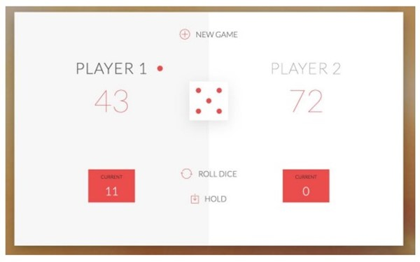

# Evaluation Sudi: Dynamiser un site web avac javascript !
 
##Le visuel est imposé par STUDI.
## Il doit ressembler à ceci : 

Règles :
 Le jeu comprend 2 joueurs sur un seul et même écran. Chaque joueur possède un score temporaire (ROUND) et un score global (GLOBAL). À chaque tour, le joueur a son ROUND initialisé à 0 et peut lancer un dé autant de fois qu'il le souhaite. Le résultat d’un lancer est ajouté au ROUND.
 
Lors de son tour, le joueur peut décider à tout moment de : - Cliquer sur l’option “Hold”, qui permet d’envoyer les points du ROUND vers le GLOBAL. Ce sera alors le tour de l’autre joueur. - Lancer le dé. S’il obtient un 1, son score ROUND est perdu et c’est la fin de son tour. Le premier joueur qui atteint les 100 points sur global gagne le jeu.

Avant de coder dans la section Javascript, J’ai décidé de faire un cahier des charges pour définir les besoins pour réaliser cet execise.
Je passe rapidement sur la création du visuel en HTML et CSS. Je n’ai pas utilisé de Framework comme Bootstrap, Materialize ou encore Bulma, mais en CSS pure.
